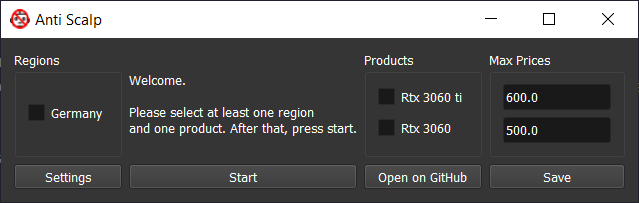
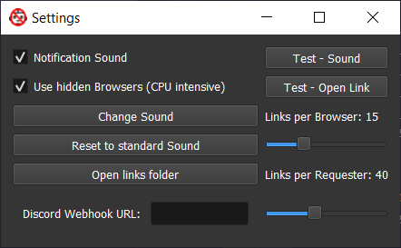

# Anti Scalp - A Stock-Checker for everyone

## The difference to other Stock-Checkers

- Runs on your PC, not on a Server you set up
- Designed and programmed with everyone in mind, not only people that know how to use a terminal
- Doesnt notify you somewhere and lets your reaction time decide when you open the link, but instead opens the link instantly in your standard browser for you
- Easy to extend
- Notifys you about updates
- Has a graphical interface

So basically: This tool isnt for informing a big group of people (like a Discord Server), but for personal use. And it definitely is better for personal use then all Stock-Checkers i saw.

Screenshots:

 
 

## What is this?

Are you the Gamer that wants a RTX 3080 to play Cyberpunk 2077 on high settings?

Do you crave for a new Ryzen CPU that noone can buy?

Do you finally want to play games on a PS 5, months after it was released?

Do you wanna wear those nice Nike sneakers that you can only buy second hand for double of the original price?

Me too man..

 

So i said: "F these Scalpers and their shiny bots, im gonna make myself something that gives me almost equal chances to buy that fancy stuff!"

 

## What it can do

This bundle of code is able to check stock of products.

Meaning you can check hundreds of links in less then a minute. You just have to find links of the products you want, obviously the ones that have normal prices but are sold out, and put them in a .txt file. Just under each other.

Then you start the program and select the regions and products you want to check, and click start.
Thats it, the program will now check the links over and over, as fast as possible. And if it finds a product that is in stock, it will play a sound and open the link in your standard browser, so you instantly click "Buy".

 

## What my focus is

This program is supposed to be the answer for people that need GPUs for Gaming and/or their job.
But this can also be used for basically everything. You can also check for CPUs, Sneakers, Lego Sets, Bananas, Air Pods etc.

So my focus was to make it easy to use, reliable, easy to configure and extendable.

Everyone should be able to use it just fine.

 

## How to use

- Windows:
  - Download the installer from the [releases page](https://github.com/ToasterUwU/Anti-Scalp/releases/latest)
  - Open the installer, install Anti-Scalp
  - Open Anti-Scalp
  - Click the "settings" button
  - click "Open links folder"
  - In the now opened folder, add folders for the regions you want (Germany, England, USA, Fantasy Land)
  - In the region folders you can now make .txt files for the products and put all the links in it (RTX 3080, Ryzen 5000 Series). You can use the Germany folder as an example
  - After adding your region(s) and the product(s) you want, you have to restart the program
  - After restarting you just tick the boxes you want to monitor
  - Click start and see the magic happen
- Linux:
  - Instead of downloading the installer, you download the linux.zip file
  - Unpack the zip
  - Open a console in the new folder of Anti-Scalp
  - "sudo apt install firefox-geckodriver"
  - "sudo apt install python3-pip"
  - "sudo pip3 install -r requirements.txt"
  - "sudo python3 anti-scalp.py"
  - Now proceed with the Windows steps, starting at 'Click the "settings" button'

In case you see a message like "Removed ***shopname*** link, ***shopname*** isnt supported. Please add it to the configuration":

- Join the [discord server](https://discord.gg/76ZAefBcC4)
- Tell me what shop you want to have added in the config
- Send me a link of a product that is sold out and one link of something that is always in stock
- Send me the selectors.json file in the directory of the anti-scalp executable

I will add the configuration for that shop. Im planning on making the process automated, but its not that easy. So it will be a feature for the future.

 

## Shops already supported

- International
  - Amazon
- Germany
  - Alternate
  - Proshop
  - Mediamarkt
  - Saturn
  - Caseking
- USA
  - Newegg
  - Bestbuy
- UK
  - Currys
  - Ebuyer

If you are missing something please join the [discord server](https://discord.gg/76ZAefBcC4) and tell me there.

 

## Help and Support

If you need any help with using Anti-Scalp, join the [discord server](https://discord.gg/76ZAefBcC4). Im happy to help.

 

## What comes in the future

- [X] ~~Autoupdate selectors.json~~
- [X] ~~Error logging for debugging~~
- [ ] Save settings
- [ ] Tutorial video for the ones that are not so good with tech
- [ ] Only notify under specific price (Will sort out moon prices)
- [ ] Average price checker
- [ ] Price history checker
- [X] ~~Automatically add product to cart~~
- [ ] Easier way to add links then making a .txt file in a folder
- [X] ~~Alternative ways of notification from sound and opening (For example: Discord Webhooks, SMS, Email)~~ Added Discord Webhook
- [ ] Auto configuration for new shops

 

## Credits

Standard Alert Sound: https://soundbible.com/2155-Text-Message-Alert-2.html

 

## Support me

I dont really want money for this, im happy if people like it, star it and share it, but if you want, you can send me some DOGE, ETH or BTC. (I will spend it on pizza and ice cream)

BTC: bc1qmnmhdyhkvdyhsrgjl8tdjmjchcsgxwzd593gej

ETH: 0x009167F0987B45a2Ab58075d283B11314fBE8AC5

DOGE: D85p9XaiJYjWxjPVERuu9FKqzbJ9kQJhXL